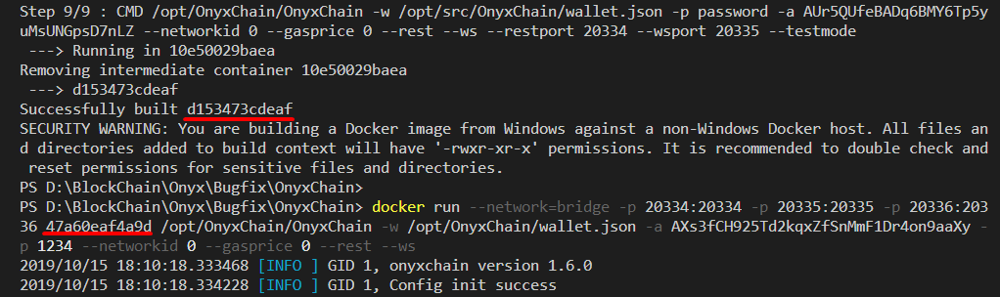
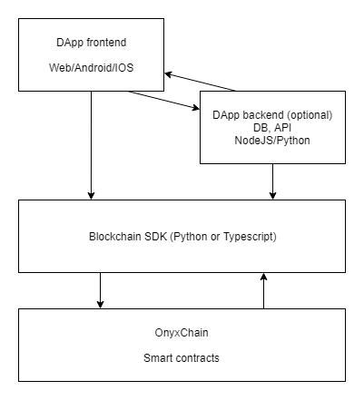

# DApp development with OnyxChain
## Introduction
### OnyxChain
OnyxChain is a blockchain network that powers the OnyxPay platform. OnyxChain is based on the popular Ontology blockchain. The network has a complete distributed ledger system, including smart contracts. The distributed ledger is an important underlying storage infrastructure of the network. The decentralized, mutually managed, and tamper-proof features of this technology are exactly what is creating trust between entities in the network. The distributed ledger provides consensus, storage, and smart contract support for the upper application framework. There is a shared data contract model that decouples data storage and business logic and implements different business logic with the use of smart contracts to improve the scalability and flexibility of the architecture on the whole network.

Since OnyxChain is a fork of the Ontology network, smart contract development and the various SDKs of OnyxChain are similar to Ontology. This guide will provide an overview of DApp development based on OnyxChain platform but for in-depth topics such as various APIs you can read the Ontology documentation (see the “links” section at the end).
Smart contracts
A smart contract is a set of instructions that is defined and permanently stored in a blockchain network. Smart contracts can be executed by all users in the network. They allow to add custom logic to blockchain transactions such as transferring funds in certain conditions to certain parties. Smart contracts allow to create distributed applications (DApps) that rely on data and logic stored in a decentralized blockchain network.

OnyxChain supports building smart contracts using Punica Suite and neptune compiler which were originally developed for the Ontology network. Smart contracts are written in Python and can be deployed using tools from the Punica suite. Unit testing can also be done using Python.
Smart contract development
Demo repository overview
For your convenience we prepared an example repository that contains a demo smart contract, unit tests for the smart contract and the necessary dependencies.

The demo smart contract is a sample token smart contract that will get you started with developing more complex smart contracts. Some basic unit tests are provided for the smart contract to demonstrate how to add test coverage to your smart contracts. You can run these tests using a local testing network or directly in the testnet.

The dependencies that are contained within the demo repository are a modified version of Ontology libraries that are necessary to write and to interact with smart contracts.

Additionally, the repository contains useful scripts that will help you with deployment and testing of your smart contracts. Specifically, there are two helper scripts for compiling and deploying smart contracts.

## Building and deployment
### Pre-requirements
Before starting development, make sure that you have all the necessary requirements installed. The software that is necessary for development:
* Python 3.7 - https://www.python.org/downloads/release/python-370/
* Git - https://git-scm.com/
* Docker - https://docker.com/

Once all the required software is installed, clone the demo repository like this:

```
git clone https://github.com/OnyxPayDev/SmartContractDemo.git
```

And install the dependencies using the provided scripts:

```
./Install
./.venv/Scripts/activate
```

After installing all dependencies you can proceed with building your smart contracts.

### Building the smart contract
Once your smart contract is ready, you have to compile it before deploying it to a network for testing. To compile a smart contract run the included “Compile.py” script in the repository. For example, to compile the DemoToken smart contract that is provided in the repository, run the following:

```
python3 Compile.py DemoToken
```

Alternatively you can use punica compile to build the smart contract manually. However, the script is more convenient as it will also manage the compiled files for you. The compilation results will be placed in the “contracts/build” folder.

### Deploying the smart contract
Once you have a compiled smart contract, you can deploy it to a blockchain network.
There are three networks to choose from to deploy a smart contract. By default, a local “devnet” will be used. The devnet is a single-node blockchain network that runs locally and can be used for testing and development. The biggest benefit of using a local network is that it’s free and runs much faster than a public network due to a simplified consensus without any validations.
To run a local testing network, clone the https://github.com/OnyxPay/OnyxChain repository like this:

```
git clone https://github.com/OnyxPay/OnyxChain.git
```

And run the following commands:

```
docker build ./docker
docker run --network=bridge -v  -p 20334:20334 -p 20335:20335 -p 20336:20336 <container_id> /opt/OnyxChain/OnyxChain -w /opt/OnyxChain/wallet.json -a “AXs3fCH925Td2kqxZfSnMmF1Dr4on9aaXy” -p “password” --networkid 0 --gasprice 0 --rest --ws --testmode
```

Where ```<container_id>``` is the image ID returned by the docker build command.  


At this point you can use the local network for testing your smart contracts. To deploy the smart contract, use the deployment script that is provided in the repository. Note that the smart contract will be deployed only if it is located in the “contracts” folder. For example, to deploy the DemoToken smart contract run:

```
python3 Deploy.py DemoToken
```

Once you tested your smart contract in a local network, you may want to test it in a public testnet. Or if you are confident that the smart contract is finished, you can deploy it to the main OnyxChain network. For a public network, you don’t need to run a local node. Instead you simply specify which network to use during deployment like this:

```
python3 Deploy.py DemoToken <network_name>
```

Where, `<network_name>` is “test” for the testnet or “main” for the main network. 

Note, that to deploy a smart contract to a public network you will need some OXG in your account. The account used for deployment must be added to a wallet file (which can be exported from the wallet https://wallet.onyxpay.co/) and it must be specified in the smart contract config file as the “payer” address (see `contracts/DemoToken-config.json` for an example configuration file). The deployment account will not have any additional functions unless specified in the smart contract.

<p style='color:red'>The demo repository contains a sample wallet with some accounts. Make sure to replace this wallet file, since it is unsafe to use accounts which were posted publicly.</p>

## Testing smart contracts
After deploying the smart contracts, you can run any unit tests that you prepared, or test the smart contracts directly. To run the unit tests, simply run the python test file, or create a separate script to run multiple tests at once (similar to the compilation script listed earlier).


Alternatively, you can use the SDK to execute smart contract functions directly, for example:

```
from ontology.ont_sdk import OntologySdk
from punica.test.test import Test


# prepare SDK instance
sdkInstance = OntologySdk()
sdkInstance.set_rpc(http://127.0.0.1/)
sdkInstance.wallet_manager.open_wallet(./wallet.json)


# prepare parameters
abiInfo = Test.get_abi_info('contracts/build/DemoToken_abi.json')
contract_address = “87fd9a371830ede50fd879c9b9a411835936766b”
from_address = “ATwo3VeAj4JnDY2uP1aKWS4p5LhyFHJeiE”
from_account = sdkInstance .wallet_manager.get_account(from_address, 'password')
to_address = “AGgWM5cmmmRUH9iwZaigYk4n4NKpkD2kEC”


#call the transfer function of the smart contract
params = dict()
params["from_address"] = from_address
params["to_address"] = to_address
params["amount"] = 1000
abiFunction = Invoke.get_function(params, 'transfer', abiInfo)
sdkInstance.neo_vm().send_transaction(
        contract_address , # smart contract
        from_address, # caller
        from_account, # payer
        500, # gas price
        300000, # gas limit
        abiFunction, # function
        False) # pre execute
```

It will be useful to create a wrapper for your smart contract functions, which will make it easier to call the smart contract as well as create unit and automated tests for your smart contracts. An example of such a wrapper is provided in the demo repository (`tests\DemoTokenWrapper.py`). The demo wrapper contains functions that help to execute the smart contract. These functions are used from unit tests (`tests\test_DemoToken.py`)
Handling multiple contracts


If your project contains multiple smart contracts, you have to build, deploy and test each smart contract separately. For convenience you can create a script for performing multiple operations using a single command. For example, a bash script to compile several smart contracts will look like this:

```
declare -a arr=("contract1" "contract2" "contract3")
for i in "${arr[@]}"
do 
  python3 Compile.py $i
done
```

Client application development
DApp architecture
A decentralized application (DApp) is an application that runs on a decentralized network. A DApp has its backend code running on a decentralized peer-to-peer network. The frontend code and user interfaces (just like in a regular app) can make calls to its backend.The interaction with the blockchain is handled by a software development kit (SDK) which provides the functions that are necessary to connect to the blockchain network. Additionally, a DApp can have a back-end component that is separate from the blockchain (off-chain) to improve performance or to store some temporary data (e.g. a database). However, the critical logic and data of the DApp are stored in the blockchain. The blockchain will provide permanence and verifiability for the stored data. The system should be able to function without off-chain components, which are added only to improve user experience. Note that every interaction with a DApp requires certain fees to be paid using OXG. The diagram below displays a sample DApp architecture.



## OnyxChain SDK
OnyxChain supports two libraries for creating DApps: a Python SDK and a Typescript SDK. The Python SDK can be used by offline apps and by the back-end of a web application. The Typescript SDK can be used directly from the front-end or on a Node JS server. There aren’t many differences between the SDKs. It is entirely up to you which language and which SDK to choose.

## Summary
OnyxChain is a modern blockchain platform that supports custom smart contracts and provides tools for DApp development. One example of such application is OnyxPay - an international remittance payment platform. Using OnyxChain developers can create separate applications as well as applications that can be easily connected with the OnyxPay platform.

## Links
* Demo repository with the smart contract example - https://github.com/OnyxPayDev/SmartContractDemo
* Punica smart contract tutorials - 
https://punica.ont.io/tutorials/
* Ontology SDK documentation - https://ontio.github.io/documentation/ontology_python_sdk_en.html
